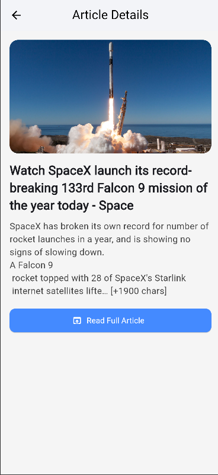

# 📰 **Daily News App**

A modern Flutter news application that displays the latest news headlines with a clean and professional UI.  
Built using Flutter (Dart) with API integration support for dynamic updates.

## ✨ **Features**

🧭 Splash Screen with animated loader  
📰 Home Screen showing latest news in elegant cards  
🔍 Search & Categories support (Technology, Sports, Business, Science, Health, Entertainment etc.)  
🔁 Refresh Button to reload news  
📄 Detailed Article View with full content and image  
🌐 Integration with NewsAPI.org

---

## 📸 Screenshots  

  
  
  
  
  
  
  
  

---

## 🧰 **Tech Stack**

**Framework:** Flutter  
**Language:** Dart  
**API Source:** NewsAPI.org  
**Architecture:** MVVM-friendly structure

---

👨‍💻 Zubair Ahmed  
